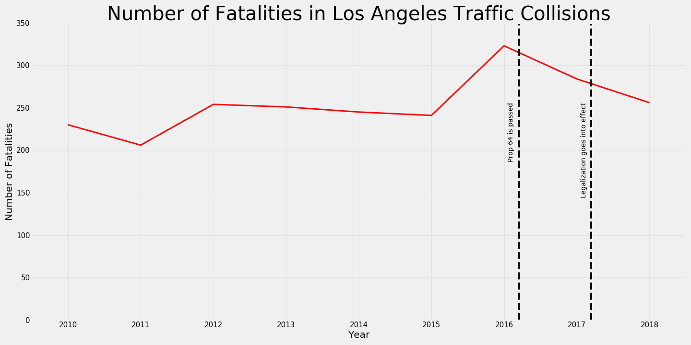
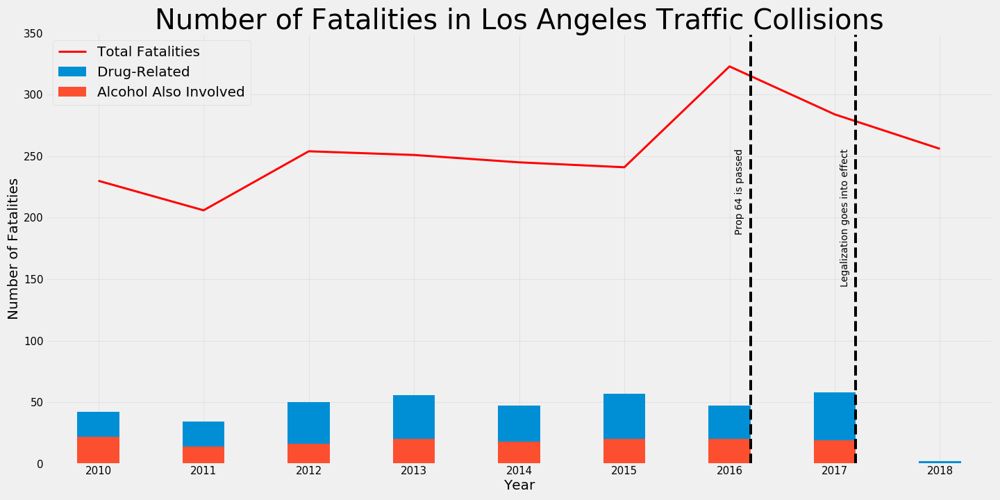
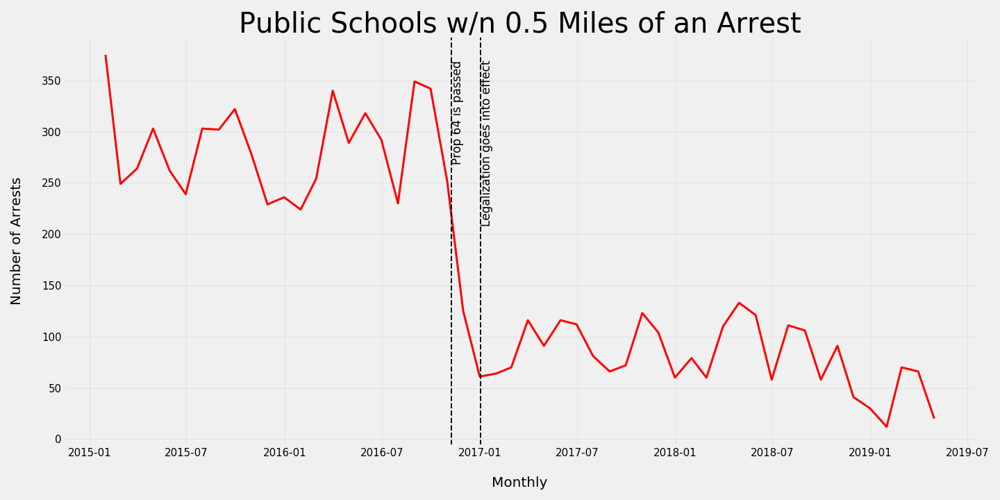
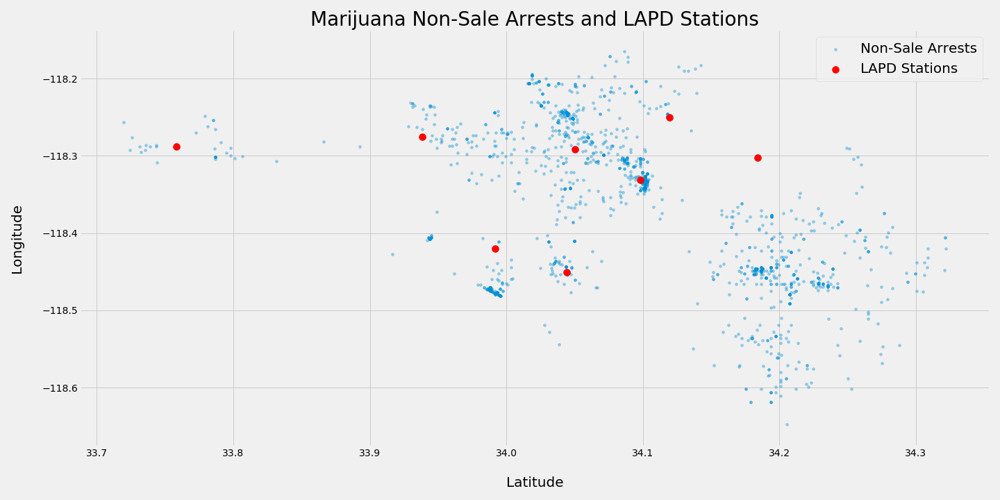
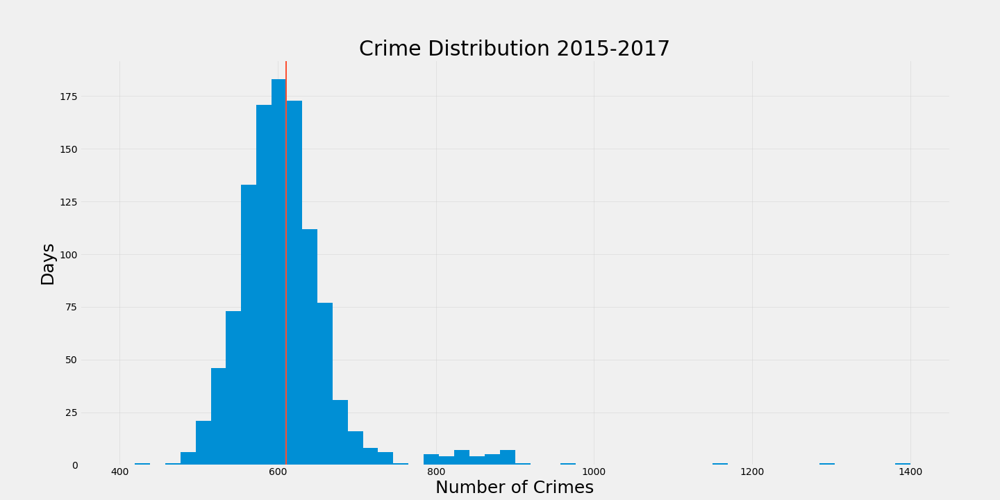
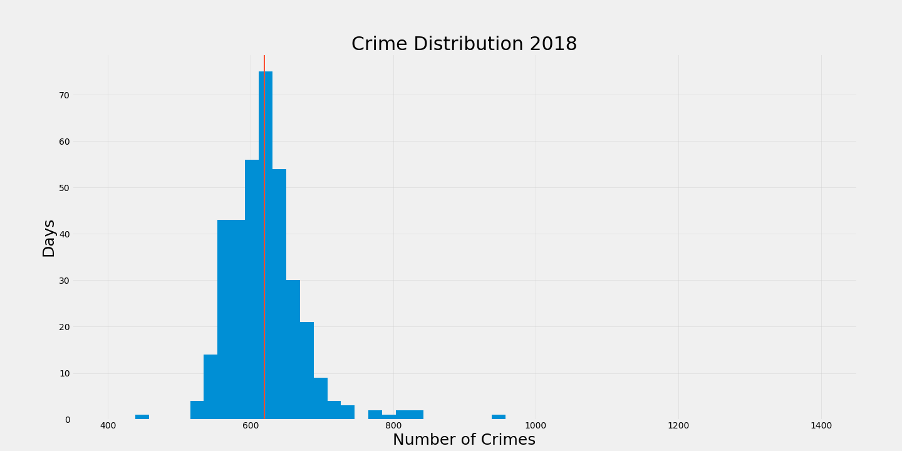
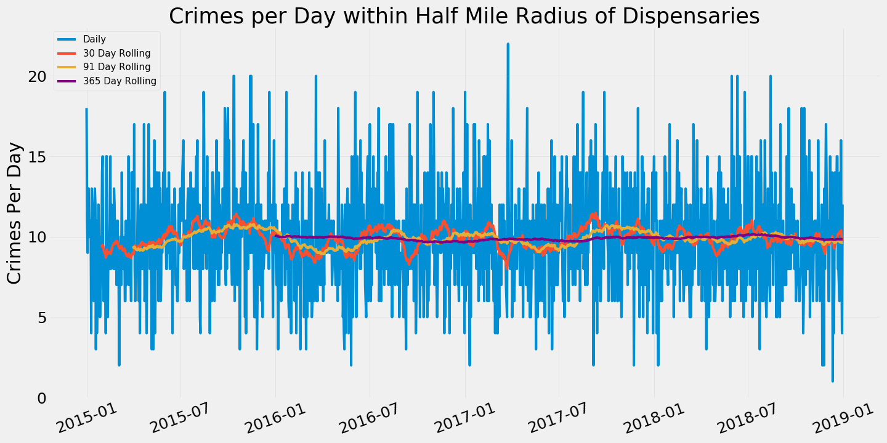
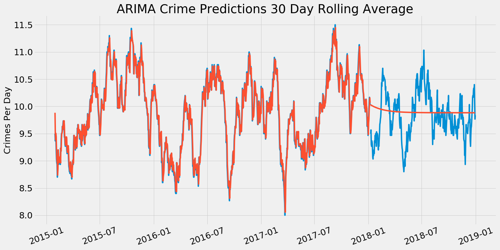

## Project 4

### Problem Statement
In 2016, California voters passed Proposition 64, which legalized recreational marijuana use in the state. Opponents to the measure presented five main objections to the change in the state’s Official Voter Information Guide. They argued that legalization would (1) double the number of highway fatalities, (2) allow marijuana growing near schools and parks, (3) increase black market and cartel activity, (4) damage poor communities with addiction problems through an influx of new dispensaries in poor neighborhoods, and (5) roll back the prohibition of smoking ads on TV. Our data-driven investigation will use time-series and geospatial analysis, as well as other more general exploratory techniques, to examine whether these predictions have come true in Los Angeles in the year since legalization took effect. Our primary focus will be on available data in the areas of traffic, arrests for marijuana-related crimes, and the general crime rate in the vicinity of dispensaries.

### Executive Summary
In short, all five predictions contained within the opposition’s arguments proved unfruitful in the first year, at least with regard to the Los Angeles area. Traffic fatalities in Los Angeles have declined since the proposition’s passing and implementation. The risk of marijuana exposure to children through schools and parks has dropped. The average crime rates near dispensaries has remained stationary. And advertisements for smoking products have not returned to California’s televisions.

### Findings
#### Opposition Argument: Doubled Traffic Fatalities
The most quantifiable argument from the Prop 64 opposition was that highway fatalities would double with the legalization of recreational marijuana.

To assess this point we requested and received collision data for the Los Angeles area from the California Highway Patrol’s Statewide Integrated Traffic Records System (SWITRS). The data covered all traffic collisions in the Los Angeles area starting on January 1, 2010 through 2018, the first full year of legalization.

From this plot we can clearly see that not only did the raw number of LA traffic fatalities not double in 2018, the number actually continued a downward trend back toward its steady hold from 2012-2015. While Los Angeles did see a spike in traffic fatalities recently, that spike occurred in 2016 before legalization went into effect.

This visualization gives us some perspective regarding the impact of drug use as an exclusive factor in fatal collisions. While the overlap with alcohol as a contributing factor is noteworthy, the amount of overlap is not enough to dismiss drug use alone as a factor in fatal collisions. That being said, the fact that these collisions have been flagged broadly as involving drug use does call the influence of marijuana specifically into question. Moving forward it would be worthwhile to revisit this subject with more granular data that speaks directly to marijuana’s influence separate from other drugs. But for now the fact remains that the projected increases in traffic fatalities after legalization have not happened to date.

#### Opposition Argument: Marijuana Growth Near Schools & Parks
One of the arguments against Prop 64 was that legalization of recreational marijuana would allow marijuana to grow near schools and parks, so one of the main concerns is marijuana use among minors and children.

For this analysis, we went to the LA data city catalog and grabbed every arrest that occurred between 2015 and 2019 and then specifically for marijuana-related arrests such as cultivating marijuana, selling to minors, possessing marijuana in schools, and smoking marijuana in public.

We then went to the Los Angeles Unified School District website and calculated the distance between every marijuana-related arrest and each LAUSD school, and then created a filter to examine arrests that occurred within 0.5 miles of a school.

The following line graph shows the monthly count of schools within a half mile distance between a marijuana related arrest per month between the beginning of 2015 and the beginning of 2019. Since the number of public schools is constant from 2015 to 2019, the number of marijuana arrests has been dropping since the passage of Prop 64. The risk of marijuana exposure to children is not that high to begin with. The maximum count of schools that were within 0.5 miles away from a marijuana arrest was 350, and it has now fluctuated between 50 and 150 since the legalization of marijuana. Taking into account 909 LA USD schools, the most recent data point at April 2019 only has 20 schools that are within 0.5 miles of marijuana related arrests, which is around 2% of total LAUSD schools.

As you can see, the risk of marijuana exposure to children is not that high to begin with, and has dropped down since the passage of Prop 64. The maximum count of marijuana-related arrests was 160 and that is taking into account around 900 LAUSD schools.

Next, we examined 4000 marijuana related arrests from 2015 to 2019 and used a logistic classification model to look at which features are most important in classifying whether each marijuana arrest is related to the possession of marijuana or related to selling marijuana. 

The features we examined were the coordinates of the arrests, the age, sex, and race of perpetrator, the number of dispensaries within a half mile from the arrest, the number of schools within a half mile from the arrest, and the area names which are based on the LAPD sections.

We want to explicitly state that the model’s purpose was not to make predictions as to whether an individual with marijuana is more likely to be arrested for one crime over the other. Rather, the objective was to examine whether certain locations are more prone to marijuana exposure through selling vs. possession of marijuana.

#### Opposition Argument: Increased Crime Near Dispensaries
Two of the opposition’s main arguments against Prop 64 suggested legalization would result in an increase in cartel and black market activity, as well as constitute “an all-out assault on underprivileged neighborhoods already reeling from alcohol and drug addiction problems.”

We investigated these points as a single argument that legalizing marijuana will increase crime in the areas immediately surrounding dispensaries.

To begin, we felt it was important to examine the overall crime rate and how the frequency of crime in 2018 compared to that of the pre-legalization era. As the following histograms show, there was a negligible shift in the distribution of crimes committed per day.

To ensure that our regional examination was not washing out a higher incidence of dispensary-driven crime, we also filtered the crimes by location and visualized the rolling mean of crimes committed within a half-mile radius of any dispensary.

As we’ve been able to see by our plots, crime rates have not increased in the immediate surrounding area of dispensaries since marijuana has been legalized. Looking at our ARIMA models and the Augmented Dickey-Fuller tests, we can see that the crime rates within a half mile radius of dispensaries is stationary, suggesting that over time, the average crime rate surrounding dispensaries remains constant, despite there being a lot of daily fluctuation.

We see that most of the crimes happen on the first of the month, which lines up perfectly with rent being due and government checks being issued. The most common crimes are petty theft, burglaries, and vehicle burglaries, which also lines up with the fact that highest frequency of crime happens on the first of the month.

#### Opposition Argument: Revival of Smoking Advertisements on Television
Prop 64’s opposition also argued that the measure would “allow marijuana smoking ads in prime time, and on programs with millions of children and teenage viewers.”

There is no deep data-driven investigation to be done with regards to this argument. But strictly as a matter of fact, Prop 64’s passing has not allowed for such advertising to take place. Federal law still maintains strict prohibitions on televised smoking advertisements, and Prop 64 has not superseded those prohibitions.

### Conclusions and Recommendations
In conclusion, the main arguments that Prop 64’s opposition advanced have not come to fruition in the first year of recreational marijuana’s legalization in Los Angeles. Though the findings contained no obvious areas of serious concern, we must emphasize that this investigation was limited in scope to the Los Angeles area. Further research into the statewide impact of legalization could contain more nuanced findings, as could future research when legalization has been in effect for several years. However, at this moment in time and for this particular region of the state, we must affirm that the outcomes most feared by Prop 64’s opponents have not been validated by our findings.